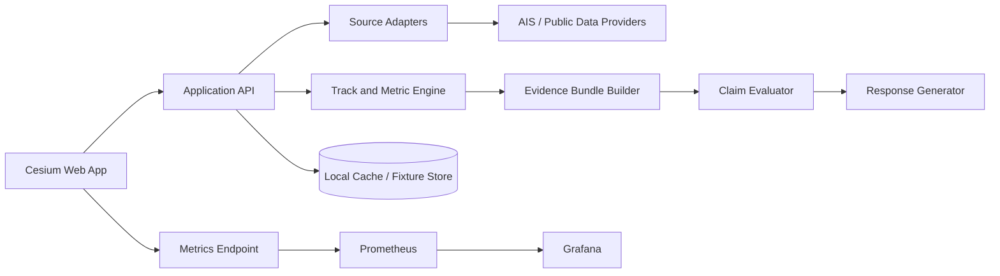

# Chokepoint

Much of the genesis of this idea comes from the very popular, https://github.com/PCSchmidt/gods-eye-view repo I forked to my Github. 


## Global Transportation Intelligence Platform

**Status:** Planning baseline  
**Audience:** Product, application, data, AI, platform, and operations contributors  
**Initial posture:** Portfolio-first public research/demo with a commercial-compatible architecture  
**Initial deployment:** Local-first, Docker-compatible web application  
**Primary visual surface:** CesiumJS globe with a freight-oriented command interface  
**Initial domain:** Maritime freight movement and chokepoint analysis  
**Future domains:** Air cargo, land freight, rail, border crossings, and multimodal correlation

---

## 1. Product Thesis

Chokepoint is a provenance-aware transportation intelligence application for understanding how the global economy moves across sea, air, and land.

The product is not intended to be a generic OSINT globe or a chatbot placed over a map. Its central capability is a verified analytical workflow:

> Observe movement, derive operational metrics, compare them with a baseline, detect meaningful change, and explain the result with evidence and uncertainty.

The product should answer questions such as:

- How many cargo vessels are currently approaching Long Beach?
- Is vessel activity at the Suez Canal unusual compared with the recent baseline?
- Which shipping chokepoints changed most over the last 24 hours?
- Are vessels waiting, transiting, or moving normally?
- What evidence supports the claim that congestion increased?
- Which parts of the answer are directly observed and which are estimates?

The application must distinguish between what a provider reports and what Chokepoint calculates. This distinction is a product feature and a core trust boundary.

### 1.1 Product promise

**Chokepoint turns public transportation signals into inspectable, source-backed movement intelligence.**

### 1.2 Product non-promise

Chokepoint does not claim to know:

- The intent of a vessel, aircraft, driver, company, or person.
- Whether an observed delay has a particular cause unless an independent source supports that claim.
- The complete state of global freight movement.
- That missing public data proves that no activity exists.
- That a derived congestion score is an official port, carrier, or government statistic.

### 1.3 Portfolio value

The project should demonstrate the full AI engineering lifecycle:

- Product framing around a real operational question.
- Public-data ingestion and normalization.
- Geospatial modeling and temporal aggregation.
- Deterministic metrics before generative AI.
- Generator/evaluator architecture for grounded answers.
- Evaluation with reproducible fixtures and held-out periods.
- Browser performance and visual interaction engineering.
- Security, attribution, observability, deployment, and maintenance.

The strongest portfolio story is not “I built a beautiful freight globe.” It is:

> I built an agent that can reason over live transportation data, distinguish observations from estimates, cite the underlying evidence, and refuse unsupported logistics claims.

---

## 2. Product Boundaries

### 2.1 Initial MVP boundary

The first release should focus on maritime movement at three globally recognizable locations:

1. **Los Angeles / Long Beach**: major North American container gateway and a compelling anchorage/approach use case.
2. **Singapore / Malacca approach**: major transshipment region and global maritime corridor.
3. **Suez Canal approaches**: globally recognizable chokepoint with meaningful directional flow.

The MVP should support a limited set of vessel categories:

- Cargo/container vessels.
- Tankers.
- Bulk carriers where source classification is reliable.
- Other vessels as visible context, clearly separated from freight counts.

The MVP should not attempt to model the entire world with equal quality. It should provide global orientation and a small number of deep, evidence-backed analytical regions.

### 2.2 Initial user workflows

#### Workflow A: Explore a chokepoint

1. User selects a chokepoint from the mission launcher or globe.
2. The camera frames the defined region.
3. The application loads the current vessel cohort and its source-health state.
4. The interface shows observed counts, movement status, recent trend, and coverage boundaries.
5. The user can select a vessel or aggregated queue cell for detail.

#### Workflow B: Ask a verified question

1. User asks a natural-language question by text or voice.
2. Intent parsing identifies the subject, geography, time window, metric, and comparison baseline.
3. The system executes deterministic tools against the normalized data model.
4. A structured evidence bundle is created.
5. An evaluator checks the proposed claims against the evidence bundle.
6. The response is generated only from accepted claims and includes source time, scope, and uncertainty.
7. The UI exposes the evidence behind the response.

#### Workflow C: Investigate change

1. User selects a chokepoint and a time range.
2. User scrubs the timeline or starts replay.
3. Vessel tracks and aggregate metrics update at the selected time.
4. Detected changes appear as bounded event cards.
5. Selecting an event opens the metric calculation, source observations, comparison window, and limitations.
6. User can copy a shareable investigation URL.

#### Workflow D: Compare locations

1. User selects two or more supported chokepoints.
2. The system applies the same metric definition and time window to each.
3. Results are displayed side by side with explicit coverage and freshness labels.
4. Comparisons are blocked or marked inconclusive when source quality is not comparable.

#### Workflow E: Save a watchlist

1. User saves a chokepoint or corridor.
2. The application records the geofence, metric, threshold, and freshness policy.
3. In a later hosted phase, a scheduled job evaluates the watchlist and emits an alert.
4. The initial local-first version may simulate this workflow from a replay dataset without sending external notifications.

---

## 3. Trust and Data Semantics

Every observation, metric, event, and generated answer must carry a source and quality contract.

### 3.1 Four truth states

| State | Meaning | Example | UI treatment |
|---|---|---|---|
| `OBSERVED` | Directly reported or decoded from a provider | Vessel position and timestamp | Solid value with source and timestamp |
| `DERIVED` | Calculated from observed records using a documented formula | Queue estimate or dwell duration | Value plus formula and confidence/coverage |
| `SIMULATED` | Generated for demonstration or fallback behavior | Land freight corridor demo density | Explicit simulated badge; never mixed into observed totals |
| `UNKNOWN` | Insufficient, stale, contradictory, or unavailable evidence | No reliable answer about queue duration | Amber/neutral state with reason |

Additional health states should be orthogonal to semantic state:

- `FRESH`
- `STALE`
- `DEGRADED`
- `UNAVAILABLE`
- `NEVER_ANSWERED`

A source can be `DERIVED + DEGRADED`; it must not be silently converted to `UNKNOWN` or presented as fresh.

### 3.2 Provenance requirements

Each displayed metric and AI claim must be traceable to:

- Provider name.
- Provider endpoint or dataset identifier.
- Retrieval timestamp.
- Source observation timestamp or interval.
- Geographic scope or geofence version.
- Transformation/version identifier.
- Data freshness threshold.
- Coverage notes.
- License and attribution identifier.
- Whether the result is observed, derived, simulated, or unknown.

### 3.3 Data quality rules

- Provider timestamps are never replaced with request receipt time.
- A cached response retains its original observation time and receives a separate cache age.
- Missing data is not treated as zero.
- A viewport cap is never treated as a complete regional count.
- A vessel without a reliable type classification is excluded from type-specific totals and counted separately as `UNCLASSIFIED`.
- Geofence membership uses a versioned geometry and a documented boundary rule.
- Metrics with insufficient sample size return `UNKNOWN` or `LOW_SAMPLE`, not a confident estimate.
- Conflicting source observations remain visible in the evidence record.

---

## 4. Functional Scope

### 4.1 Globe and map experience

The globe should borrow the strongest interaction patterns from God's Eye View while replacing the tactical/OSINT visual language with a transportation operations language.

Required capabilities:

- CesiumJS globe with a keyless-compatible fallback map stack.
- Sea, air, and land visual modes.
- Chokepoint mission launcher on first run.
- Camera framing for ports, canals, corridors, and airports.
- Vessel points, tracks, density cells, and selected-vessel detail.
- Horizon and viewport culling.
- Bounded label/card cohorts with deterministic selection.
- Timeline/replay mode for supported historical or fixture data.
- Shareable URL state for location, time window, enabled modes, and selected event.
- Responsive layout with a useful mobile investigation mode.
- Visible source attribution and data-quality status.

### 4.2 Freight metric cards

The initial metric cards should be calculated from the same evidence engine used by the voice and API surfaces.

Candidate cards:

- Freight vessels observed in region.
- Vessels moving below the configurable movement threshold.
- Vessels entering/exiting during the selected interval.
- Estimated dwell or waiting cohort size.
- Median/percentile speed within the geofence.
- Change versus prior comparable window.
- Data age and source coverage.

Avoid a single “congestion” number until its definition is stable. Display component metrics first, then provide a composite index only when its behavior is evaluated.

### 4.3 Chokepoint profiles

Each supported location should have a versioned configuration:

```json
{
  "id": "long-beach-approach",
  "name": "Los Angeles / Long Beach",
  "region": "North America",
  "geometryVersion": "2026-09-01",
  "geofences": [
    {
      "id": "outer-anchorage",
      "purpose": "waiting-cohort",
      "geometry": "versioned polygon or multipolygon"
    },
    {
      "id": "approach-corridor",
      "purpose": "approach-flow",
      "geometry": "versioned polygon or corridor"
    }
  ],
  "supportedMetrics": [
    "vessel_count",
    "moving_fraction",
    "entry_count",
    "exit_count",
    "dwell_estimate"
  ],
  "limitations": [
    "AIS coverage does not represent every vessel",
    "geofence does not equal official port boundary"
  ]
}
```

Configuration must be data-driven, reviewed, tested, and attributable. It must not be scattered through UI conditionals.

### 4.4 Voice and text agent

Voice is a first-class interface only after the deterministic data tools are stable.

Initial supported intents:

- `summarize_chokepoint`
- `count_vessels`
- `compare_with_baseline`
- `list_recent_changes`
- `show_vessel_cohort`
- `focus_chokepoint`
- `set_time_window`
- `start_replay`
- `stop_replay`
- `explain_metric`

The agent must not directly invent database queries, mutate arbitrary state, or answer from raw provider text. Every tool returns a typed result with scope and provenance.

Example:

```json
{
  "tool": "summarize_chokepoint",
  "arguments": {
    "chokepointId": "long-beach-approach",
    "window": "last_24_hours"
  },
  "result": {
    "status": "ok",
    "claims": [
      {
        "id": "claim-1",
        "text": "37 classified freight vessels were observed in the outer anchorage window.",
        "kind": "observed",
        "support": ["obs-1001", "obs-1002"],
        "confidence": 0.96
      },
      {
        "id": "claim-2",
        "text": "The observed low-speed cohort was 18% above the prior comparable window.",
        "kind": "derived",
        "support": ["metric-44", "baseline-11"],
        "confidence": 0.78,
        "limitations": ["Coverage is limited to vessels visible to the source feed."]
      }
    ],
    "coverage": {
      "sourceState": "degraded",
      "lastObservationAt": "2026-09-09T12:00:00Z",
      "scopeLabel": "defined outer anchorage geofence"
    }
  }
}
```

### 4.5 Evidence drawer

Every answer and event must have an inspectable evidence view containing:

- Plain-language conclusion.
- Observed inputs.
- Formula or detector version.
- Comparison baseline.
- Source links/attribution.
- Freshness and coverage.
- Counter-evidence or ambiguity.
- Why a claim was downgraded or rejected.

The evidence drawer should be useful without reading code or logs.

---

## 5. Data Architecture

### 5.1 Source adapter contract

Each source module should implement a lifecycle contract similar to the inspiration project’s data layers, but with explicit ingestion and provenance responsibilities.

```ts
export interface SourceAdapter<TRecord> {
  id: string;
  label: string;
  license: LicenseMetadata;
  capabilities: SourceCapabilities;
  enable(context: SourceContext): Promise<SourceResult>;
  disable(): Promise<void>;
  refresh(context: RefreshContext): Promise<SourceResult>;
  getStatus(): SourceStatus;
  getRecords(scope: QueryScope): ReadonlyArray<TRecord>;
  getAttribution(): AttributionRecord;
  destroy(): void;
}
```

The adapter owns:

- Provider request details.
- Response validation.
- Normalization into the canonical schema.
- Retry/backoff and cache policy.
- Source-specific health and freshness.
- Attribution metadata.

It must not own global UI layout, AI prompting, or unrelated camera state.

### 5.2 Canonical observation model

```ts
interface TransportObservation {
  observationId: string;
  entityId: string;
  mode: "sea" | "air" | "land" | "rail";
  entityType: "cargo_vessel" | "tanker" | "bulk_carrier" | "aircraft" | "vehicle" | "unknown";
  position: {
    latitude: number;
    longitude: number;
    altitudeMeters?: number;
  };
  kinematics: {
    speedKnots?: number;
    speedKph?: number;
    headingDegrees?: number;
  };
  observedAt: string;
  receivedAt: string;
  source: {
    providerId: string;
    endpointId: string;
    recordRef?: string;
    licenseId: string;
  };
  quality: {
    sourceState: "fresh" | "stale" | "degraded" | "unavailable";
    positionAccuracy?: "exact" | "approximate" | "unknown";
    classification: "confirmed" | "inferred" | "unknown";
  };
}
```

### 5.3 Track model

Track construction must preserve raw observations and derived interpolation separately.

```ts
interface TrackSegment {
  trackId: string;
  entityId: string;
  observations: string[];
  startAt: string;
  endAt: string;
  interpolation: {
    method: "none" | "linear" | "kinematic";
    maxGapSeconds: number;
  };
  quality: {
    observedPointCount: number;
    interpolatedPointCount: number;
    largestGapSeconds: number;
    sourceState: string;
  };
}
```

Interpolated positions are never represented as if directly observed.

### 5.4 Geofences and corridors

Geospatial definitions should be versioned records with:

- Stable identifier.
- Human-readable purpose.
- Geometry version.
- Coordinate reference assumptions.
- Inclusion/exclusion rules.
- Effective date.
- Review owner.
- Source or rationale.

### 5.5 Derived metric model

```ts
interface DerivedMetric {
  metricId: string;
  metricType: string;
  scope: QueryScope;
  value: number | null;
  unit: string;
  computedAt: string;
  observationWindow: {
    startAt: string;
    endAt: string;
  };
  formulaVersion: string;
  inputs: string[];
  quality: {
    state: "fresh" | "stale" | "degraded" | "unknown";
    sampleCount: number;
    coverageNote: string;
    confidence?: number;
  };
}
```

### 5.6 Evidence bundle

The evidence bundle is the contract between deterministic analytics and generative explanation.

```ts
interface EvidenceBundle {
  bundleId: string;
  createdAt: string;
  question: {
    rawText: string;
    normalizedIntent: string;
    scope: QueryScope;
  };
  observations: EvidenceObservation[];
  metrics: DerivedMetric[];
  events: DetectedEvent[];
  sourceHealth: SourceStatus[];
  claimsAllowed: AllowedClaim[];
  claimsRejected: RejectedClaim[];
  versions: {
    schema: string;
    metric: string;
    detector?: string;
    evaluator: string;
  };
}
```

---

## 6. Initial Data Sources

The exact source set must be confirmed against current terms before implementation. The table below is an architecture target, not a blanket assertion that every provider is suitable for commercial redistribution.

| Capability | Candidate source | Initial use | Key risk |
|---|---|---|---|
| Live vessel positions | AISStream or another permitted AIS provider | Selected regional vessel observations | API terms, coverage, historical retention |
| Vessel classification | AIS message fields plus source metadata | Cargo/tanker/bulk filtering | Missing or incorrect classifications |
| Port/chokepoint context | OpenStreetMap / public geospatial sources | Port geometry and contextual map features | ODbL attribution and derived-database obligations |
| Baseline fixtures | Synthetic tracks plus legally retained observations | Deterministic testing and demos | Must never be presented as live data |
| Air cargo positions | adsb.lol or another permitted feed | Later cargo-aircraft layer | Coverage, terms, operator classification |
| Border wait times | CBP or relevant government source | Later land layer | Geographic scope and update reliability |
| Traffic flow | Optional TomTom or permitted public source | Later land corridor layer | Proprietary terms and request costs |
| Port throughput | Official port/open-data sources | Later contextual metric | Different definitions and reporting cadence |

### 6.1 Data-source admission gate

A source cannot enter production configuration until its record documents:

- Terms and commercial status.
- Whether raw data may be stored.
- Whether normalized/derived data may be stored.
- Required attribution.
- Rate limits and quotas.
- Acceptable caching duration.
- Coverage and known blind spots.
- Failure behavior.
- Removal plan if terms change.

### 6.2 Keyless-first strategy

The MVP should run without optional credentials using:

- Synthetic replay fixtures.
- Small checked-in test fixtures with clear provenance.
- A keyless or locally configured provider where permitted.
- Empty but honest states for unavailable live layers.

A missing provider key must not make the whole application appear broken.

---

## 7. Metric Definitions

Metric definitions must be documented and tested before being used in marketing copy or AI responses.

### 7.1 Vessel count

**Definition:** Number of unique classified vessel entities with at least one accepted observation inside a named geofence during a specified observation window.

Parameters:

- Entity deduplication key.
- Geofence version.
- Observation window.
- Classification allowlist.
- Freshness threshold.

The UI must say “observed vessels in the defined geofence,” not “all vessels at the port.”

### 7.2 Moving fraction

**Definition:** Fraction of eligible observed vessel entities whose accepted speed exceeds a documented threshold during the window.

A vessel with missing speed is not counted as stopped.

### 7.3 Entry and exit counts

**Definition:** Number of unique entities crossing a geofence boundary in the specified direction during the window, based on consecutive accepted observations and a defined interpolation policy.

Boundary crossings with an excessive observation gap are marked uncertain or excluded.

### 7.4 Dwell estimate

**Definition:** Duration between first and last accepted observation inside a geofence for an entity, subject to minimum observation count and maximum gap constraints.

This is not official port dwell time. The UI must label it as an estimate and show the inclusion rules.

### 7.5 Congestion index

A composite congestion index should be deferred until component metrics are validated. If introduced, it must:

- Be versioned.
- Expose component contributions.
- Have a documented baseline window.
- Be calibrated against known historical conditions where possible.
- Avoid labels such as “severe” unless thresholds are empirically justified.

---

## 8. AI Architecture: Generator and Evaluator

### 8.1 Principle

The model is a language interface over evidence, not the source of truth.

### 8.2 Generator responsibilities

The generator may:

- Convert a user question into a typed intent.
- Select from an allowlisted tool set.
- Draft a response from an accepted evidence bundle.
- Explain formulas and limitations in accessible language.

The generator may not:

- Invent observations.
- Treat absent data as zero.
- Expand the geographic scope without confirmation.
- Rename a derived estimate as an observed fact.
- Infer intent, threat, or causation without evidence.
- Bypass the evaluator.

### 8.3 Evaluator responsibilities

The evaluator should check:

- Every numeric claim matches a metric or observation.
- Every source-backed claim has a provenance reference.
- The time window and geography match the user request.
- Freshness and coverage caveats are included when material.
- Derived language is not presented as direct observation.
- Unsupported causal, predictive, or threat language is rejected.
- The answer does not exceed the confidence supported by the evidence.
- Counts use the correct scope semantics.

### 8.4 Claim types

Allowed claim categories:

- `OBSERVATION`: directly supported source record.
- `CALCULATION`: reproducible metric from accepted inputs.
- `COMPARISON`: difference from a named baseline.
- `QUALITY`: source freshness, coverage, or uncertainty.
- `LIMITATION`: what the evidence cannot establish.

Restricted or rejected categories:

- `INTENT`
- `THREAT`
- `CAUSE` without independent evidence
- `IDENTITY` beyond provider-published entity metadata
- `PREDICTION` without a validated predictive model

### 8.5 Evaluator output

```json
{
  "verdict": "accepted_with_caveats",
  "acceptedClaims": ["claim-1", "claim-2"],
  "rejectedClaims": [
    {
      "claim": "The port is experiencing a major disruption.",
      "reason": "No validated disruption threshold or independent corroboration."
    }
  ],
  "requiredCaveats": [
    "AIS coverage is incomplete.",
    "The waiting cohort is a derived estimate, not an official port statistic."
  ],
  "evaluatorVersion": "claim-evaluator-v1"
}
```

### 8.6 Voice safety

Voice actions must be transactional and observable:

- A request is accepted only when the tool returns success.
- A failed or partial data request is reported as such.
- Camera movement and layer changes have separate ownership from analytical results.
- A voice response cannot claim that a visual state changed unless the UI confirms it.
- Destructive or expensive actions require explicit confirmation in later hosted versions.

---

## 9. Frontend Architecture

### 9.1 Recommended stack

- Vite.
- TypeScript or carefully typed modern JavaScript.
- CesiumJS for the globe.
- Vanilla modules or a small UI layer consistent with God's Eye View.
- Playwright or Puppeteer for browser QA.
- Vitest or Node test runner for deterministic domain tests.
- CSS custom properties for freight-specific theming.

Do not introduce a large frontend framework solely for convention. The system should preserve clear ownership between scene, data, overlays, panels, and agent controls.

### 9.2 Module boundaries

```text
src/
  main.ts
  app/
    appState.ts
    startup.ts
    shareState.ts
  scene/
    globe.ts
    camera.ts
    renderGovernor.ts
    mapStack.ts
  data/
    manager.ts
    sourceAdapter.ts
    ais.ts
    geofences.ts
    provenance.ts
    sourceHealth.ts
  analytics/
    observations.ts
    tracks.ts
    metrics.ts
    baselines.ts
    events.ts
    evidence.ts
  agent/
    intent.ts
    tools.ts
    generator.ts
    evaluator.ts
    voiceSession.ts
  overlays/
    worldOverlay.ts
    vesselCards.ts
    eventCards.ts
    evidenceOverlay.ts
  ui/
    missionLauncher.ts
    freightHud.ts
    timeline.ts
    evidenceDrawer.ts
    watchlist.ts
  config/
    chokepoints.ts
    sourceRegistry.ts
    attribution.ts
  telemetry/
    metrics.ts
    diagnostics.ts
```

### 9.3 UI visual direction

The visual direction should retain cinematic clarity while moving away from green-phosphor tactical surveillance aesthetics.

- Dark slate/navy foundation.
- Sea blue for maritime state.
- Amber for air cargo.
- Green for land/logistics flow.
- Red reserved for degraded or threshold-exceeded conditions, never generic emphasis.
- Restrained glass panels with dense operational typography.
- Freight icons and short metric labels.
- Scrolling status ticker for source freshness and movement events.
- Clear data-state badges: `LIVE`, `DERIVED`, `ESTIMATE`, `SIM`, `STALE`, `UNKNOWN`.
- Attribution always available and never hidden by clean-view mode.

The landing screen should be the working application, not a marketing hero. The first viewport should show the globe, current freight state, and one clear path into a chokepoint investigation.

### 9.4 Responsive strategy

Desktop is the primary analytical surface. Mobile should support:

- Chokepoint selection.
- Metric summary.
- Event list.
- Evidence review.
- Timeline scrubbing at reduced detail.
- Share-link opening.

The mobile layout should not attempt to replicate every desktop rail. It should prioritize the selected event and evidence drawer over ambient globe decoration.

---

## 10. Backend and Service Architecture

### 10.1 Initial local architecture



The first implementation can run as one application process with clearly separated modules. Do not split into microservices before deployment or data volume requires it.

### 10.2 Hosted evolution

Later hosted deployment may separate:

- Ingestion workers.
- Normalization workers.
- Metric/event jobs.
- Query API.
- Web frontend.
- Alert scheduler.
- Evidence and investigation persistence.

The hosted architecture should preserve the same contracts, especially source status, provenance, metric versions, and evaluator output.

### 10.3 API resources

Initial API candidates:

```text
GET  /api/health
GET  /api/ready
GET  /api/sources
GET  /api/chokepoints
GET  /api/chokepoints/:id/summary
GET  /api/chokepoints/:id/observations
GET  /api/chokepoints/:id/metrics
GET  /api/chokepoints/:id/events
GET  /api/tracks/:id
POST /api/query
POST /api/evaluate
GET  /api/attribution
GET  /metrics
```

API responses should use stable envelopes:

```json
{
  "status": "ok",
  "data": {},
  "quality": {
    "state": "fresh",
    "observedAt": "2026-09-09T12:00:00Z",
    "coverage": "defined approach geofence"
  },
  "provenance": [],
  "errors": []
}
```

### 10.4 Caching and quotas

All external calls require:

- Fixed upstream host allowlists.
- Request timeout.
- Response-size limit.
- Schema validation.
- Rate limiting.
- In-flight request deduplication.
- Bounded memory/disk cache.
- Stale fallback policy.
- Sanitized client errors.
- Provider attribution.

A cached response must never be presented as current without its original observation timestamp and cache age.

---

## 11. Persistence and Share State

### 11.1 Local-first persistence

The MVP may use:

- Versioned local storage for user display preferences.
- IndexedDB or a bounded local cache for fixture/replay data.
- URL hash or query parameters for shareable investigation state.
- No secrets in local storage or share URLs.

### 11.2 Shareable state

Share state may include:

- Chokepoint ID.
- Camera destination.
- Enabled transportation modes.
- Selected entity or event ID.
- Time window.
- Replay timestamp.
- Visual preset.
- Selected metric.

Share state must not include:

- API keys.
- Provider credentials.
- Private user data.
- Unbounded raw observations.
- Mutable cache contents.
- In-progress voice transcripts.

### 11.3 Hosted persistence

A future hosted version may add:

- Accounts.
- Saved investigations.
- Watchlists.
- Alert preferences.
- Team workspaces.
- Audit history.

These are explicitly outside the MVP implementation unless user validation requires them.

---

## 12. Evaluation Strategy

Evaluation begins before the first LLM integration.

### 12.1 Deterministic domain tests

Test:

- Provider payload normalization.
- Invalid coordinate rejection.
- Timestamp ordering.
- Duplicate observation handling.
- Entity identity stability.
- Vessel classification rules.
- Geofence membership.
- Boundary crossing detection.
- Track segmentation.
- Interpolation limits.
- Dwell calculation.
- Baseline comparison.
- Fresh/stale/degraded/unknown state transitions.
- Provenance propagation.
- Claim acceptance and rejection.

### 12.2 Fixture design

Fixtures should include:

- Normal transit.
- Stationary anchorage behavior.
- Port entry and exit.
- Missing position intervals.
- Duplicate provider records.
- Out-of-order timestamps.
- Classification changes.
- Source outage.
- Stale cache fallback.
- Conflicting source data.
- Synthetic land layer clearly labeled as simulated.

### 12.3 Detector metrics

For event detection, report:

- Precision.
- Recall.
- F1 score.
- False positives per entity-hour.
- Detection latency.
- Minimum sample size behavior.
- Calibration/reliability.
- Sensitivity to missing data.
- Stability across geography and vessel class.

### 12.4 Evaluator metrics

For generated answers, report:

- Numeric claim accuracy.
- Evidence citation coverage.
- Unsupported claim rejection rate.
- Scope mismatch rate.
- Freshness caveat coverage.
- Derived-versus-observed labeling accuracy.
- Human-rated usefulness and clarity.
- Abstention quality.

### 12.5 Browser and performance tests

Test:

- Replay determinism.
- Camera framing.
- Event selection.
- Timeline scrubbing.
- Share-link restoration.
- Source failure rendering.
- Responsive layout at desktop and mobile widths.
- Keyboard and screen-reader interaction.
- Bounded overlay candidate count.
- Idle render behavior.
- Replay frame budget.
- Memory growth over repeated enable/disable cycles.

### 12.6 Evaluation artifacts

Publish or retain:

- Dataset manifest.
- Fixture provenance.
- Metric definitions.
- Model/detector version.
- Evaluation command.
- Metric output.
- Known failures.
- Screenshots or short recordings of replay and evidence inspection.

---

## 13. Observability

### 13.1 Application metrics

Recommended Prometheus metrics:

```text
chokepoint_http_requests_total
chokepoint_http_request_duration_seconds
chokepoint_http_errors_total
chokepoint_source_refresh_total
chokepoint_source_refresh_duration_seconds
chokepoint_source_records_accepted_total
chokepoint_source_records_rejected_total
chokepoint_source_freshness_seconds
chokepoint_source_cache_hits_total
chokepoint_source_cache_stale_served_total
chokepoint_metric_computations_total
chokepoint_metric_computation_duration_seconds
chokepoint_detected_events_total
chokepoint_evidence_bundles_total
chokepoint_claims_accepted_total
chokepoint_claims_rejected_total
chokepoint_agent_requests_total
chokepoint_agent_tokens_total
chokepoint_agent_cost_estimate_usd
chokepoint_replay_frames_total
chokepoint_overlay_candidates
chokepoint_overlay_painted
```

Labels must be bounded. Never use raw entity IDs, user text, or arbitrary coordinates as Prometheus labels.

### 13.2 Grafana dashboards

Initial dashboards:

1. **Source Health**
   - Provider success/failure.
   - Freshness by source.
   - Cache hits and stale fallback.
   - Accepted/rejected records.
   - Request latency and quota signals.

2. **Analytics Quality**
   - Metric computation latency.
   - Event counts by type and region.
   - Score distributions.
   - Evaluation metrics.
   - Unknown/degraded result rate.

3. **Agent Groundedness**
   - Query volume.
   - Tool latency.
   - Accepted/rejected claims.
   - Citation coverage.
   - Abstention rate.
   - Token/cost estimate.

4. **Frontend Runtime**
   - Replay frame budget.
   - Overlay candidates versus painted entries.
   - Render governor state.
   - Client errors.
   - Approximate memory/reload diagnostics where available.

### 13.3 Structured logs

Logs should include:

- Correlation ID.
- Request or job ID.
- Source ID.
- Chokepoint ID.
- Metric/detector version.
- Result status.
- Duration.
- Error class.
- Data quality state.

Logs must redact API keys, authorization headers, voice transcripts where not required, and sensitive raw payloads.

---

## 14. Security, Privacy, and Responsible Use

### 14.1 Secret handling

- Private provider keys remain server-side.
- Browser-visible map tokens are restricted by origin and API scope.
- `.env` files remain ignored.
- No credentials are placed in share URLs, logs, screenshots, or fixtures.
- Hosted deployments require provider-side spend limits in addition to application throttles.

### 14.2 Proxy security

- No arbitrary upstream URLs from clients.
- Fixed source allowlists.
- SSRF protections for any user-influenced destination.
- Response-size and timeout caps.
- Sanitized errors.
- Per-client and global rate limits.
- Request body limits.
- Cache poisoning protections.
- Schema validation before persistence.

### 14.3 Privacy boundary

The application should operate on transportation entities and aggregate movement patterns, not people. Do not add:

- Named-person tracking.
- Facial recognition.
- Driver identification.
- Personal travel profiling.
- Sensitive location inference.

Where provider identifiers are retained, minimize retention and document why they are necessary.

### 14.4 Responsible language

The UI and agent should prefer:

- “Observed.”
- “Estimated.”
- “Consistent with.”
- “The available data suggests.”
- “Insufficient evidence.”
- “Coverage is incomplete.”

Avoid:

- “Confirmed disruption” without authoritative corroboration.
- “Suspicious vessel.”
- “Threat.”
- “Intentional delay.”
- “No activity” when the source may be incomplete.

---

## 15. Licensing and Attribution

The code license and data licenses must remain separate.

Before adding each source, record:

- Provider and dataset.
- License/terms URL.
- Commercial-use status.
- Redistribution and caching rules.
- Required attribution.
- Whether transformed data may be committed.
- Whether screenshots may contain the data.
- Removal or replacement plan.

The application should have a visible attribution control that includes:

- Provider name.
- Data timeframe.
- Coverage limitations.
- Link to terms where appropriate.
- Current source status.

Do not assume that an open API permits commercial redistribution, long-term storage, or repackaging. A source that is acceptable for a local portfolio demo may require replacement before a commercial launch.

---

## 16. Deployment Strategy

### 16.1 Phase 1: Local-first

- One-command local startup.
- Optional provider credentials.
- Fixture mode available without credentials.
- Docker Compose for app, metrics, Prometheus, and Grafana.
- Clear health and readiness endpoints.
- Seed/demo data only when explicitly labeled.

### 16.2 Phase 2: Public demo

- Static or hosted frontend where possible.
- Server-side API for provider access.
- Strict quotas and rate limits.
- Read-only demo mode.
- No unauthenticated expensive voice or data endpoints without protection.
- Public status/limitations page.

### 16.3 Phase 3: Product experiment

Only after user validation:

- Authentication.
- Saved investigations.
- Watchlists and alerts.
- Scheduled ingestion.
- Durable database.
- Team sharing.
- Usage metering.
- Subscription or paid research tiers.

### 16.4 Mobile strategy

Build the web application as a responsive PWA first. Native mobile is a later companion, focused on:

- Alert inbox.
- Saved chokepoint summaries.
- “What changed?” briefings.
- Evidence review.
- Deep links to web investigations.

A mobile app should not duplicate the full desktop globe. The mobile product is about awareness and triage; the web product is about investigation.

---

## 17. Delivery Roadmap

### Phase 0: Product and source contract

Deliverables:

- Product name and domain decision.
- Source/license matrix.
- Three chokepoint definitions.
- Canonical observation schema.
- Truth-state vocabulary.
- Initial non-claims and responsible-use copy.
- Architecture decision record.

Exit criteria:

- Every initial source has a documented terms decision.
- Metric definitions are written before implementation.
- The project can run in fixture mode without credentials.

### Phase 1: Data foundation

Deliverables:

- Source adapter interface.
- Fixture loader.
- AIS normalization.
- Provenance records.
- Source health state machine.
- Geofence registry.
- Unit tests for malformed and degraded inputs.

Exit criteria:

- Deterministic fixture ingestion passes.
- Stale, unavailable, and unknown states render correctly.
- No invalid record reaches analytics.

### Phase 2: Maritime analytics

Deliverables:

- Vessel cohort filtering.
- Track segmentation.
- Geofence entry/exit.
- Moving fraction.
- Dwell estimate.
- Baseline comparison.
- Event detector for unusual movement/queue behavior.
- Evaluation report.

Exit criteria:

- Metrics are reproducible from fixture manifests.
- Every result has provenance and quality metadata.
- Detector performance is documented, including failures.

### Phase 3: Cesium product surface

Deliverables:

- Freight visual theme.
- Chokepoint mission launcher.
- Vessel and cohort layers.
- Metric cards.
- Timeline and replay.
- Event cards.
- Evidence drawer.
- Share-link state.
- Responsive desktop/mobile layout.

Exit criteria:

- Core investigation works without voice.
- Replay is deterministic.
- Browser performance stays within documented budgets.
- Attribution remains visible.

### Phase 4: Verified agent

Deliverables:

- Typed query intents.
- Deterministic data tools.
- Evidence bundle builder.
- Claim evaluator.
- Text query surface.
- Optional OpenAI Realtime voice interface.
- Groundedness evaluation set.

Exit criteria:

- Unsupported claims are rejected or caveated.
- Numeric answers match deterministic metrics.
- Voice actions report actual tool outcomes.
- Provider failure does not create fabricated answers.

### Phase 5: Ship and observe

Deliverables:

- Docker Compose.
- CI workflow.
- Prometheus endpoint.
- Grafana dashboards.
- Structured logs.
- Health/readiness checks.
- Security review.
- Clean-machine setup instructions.
- Product README and case study.

Exit criteria:

- Reproducible build and test path.
- No credentials or prohibited data in repository.
- Metrics scrape successfully.
- Local install works in fixture mode.
- Documentation matches runtime behavior.

### Phase 6: Public beta decision

Evaluate:

- Do users understand the product without explanation?
- Do they trust the evidence drawer?
- Which chokepoints generate repeat interest?
- Are alerts more valuable than exploration?
- Are source costs and licenses sustainable?
- Is the product useful enough to justify accounts and persistence?

Only then decide whether to purchase additional data, deploy durable infrastructure, or build the mobile companion.

---

## 18. Repository Layout

Recommended initial repository structure:

```text
chokepoint_app/
  CHOKEPOINT-PLAN.md
  README.md
  AGENTS.md
  CONTRACT.md
  DATA_SOURCES.md
  SECURITY.md
  STATUS.md
  package.json
  package-lock.json
  vite.config.ts
  tsconfig.json
  docker-compose.yml
  Dockerfile
  .env.example
  .gitignore
  .github/
    workflows/
      ci.yml
  src/
    main.ts
    app/
    scene/
    data/
    analytics/
    agent/
    overlays/
    ui/
    config/
    telemetry/
  tests/
    fixtures/
    unit/
    browser/
    evaluation/
  public/
    assets/
  observability/
    prometheus.yml
    grafana/
      provisioning/
      dashboards/
  scripts/
    validate-data-contract.mjs
    run-evaluation.mjs
    qa-replay.mjs
    qa-evidence.mjs
```

`CHOKEPOINT-PLAN.md` is the planning baseline. `CONTRACT.md` should later contain the stable source, metric, evidence, and agent contracts. `STATUS.md` should record measured progress and known limitations rather than optimistic completion claims.

---

## 19. Decision Log

### Decision 1: Maritime-first MVP

**Decision:** Begin with sea freight and three chokepoints.  
**Reason:** AIS-like movement data maps naturally to the globe, provides compelling visual behavior, and supports measurable derived metrics.  
**Rejected alternative:** Launching sea, air, and land simultaneously would create inconsistent coverage and unclear metric semantics.

### Decision 2: Evidence before voice

**Decision:** Build deterministic metrics and evidence bundles before adding voice.  
**Reason:** The agent must have a trustworthy contract to call.  
**Rejected alternative:** Starting with a voice demo would optimize for spectacle before correctness.

### Decision 3: Cesium remains the visual substrate

**Decision:** Reuse a Cesium globe, but only bounded freight-specific layers are in scope.  
**Reason:** The globe creates strong visual continuity with God's Eye View and makes global chokepoints intuitive.  
**Constraint:** The analytical value must remain visible in the timeline, metric, and evidence surfaces; 3D cannot become decoration alone.

### Decision 4: Keyless-first validation

**Decision:** Fixture mode and permitted free/keyless sources are required.  
**Reason:** This controls cost, avoids premature provider lock-in, and makes CI reproducible.

### Decision 5: PWA before native mobile

**Decision:** Build responsive web and PWA capability before native mobile.  
**Reason:** Investigation belongs on the web; mobile value is primarily alert review and triage.

---

## 20. Immediate Next Actions

1. Confirm the product name and check domain/trademark availability.
2. Create `AGENTS.md`, `CONTRACT.md`, `DATA_SOURCES.md`, `SECURITY.md`, and `STATUS.md` from this baseline.
3. Decide the exact AIS provider and whether its terms permit the intended local/public demo.
4. Define the three chokepoint geofences and commit their first version with provenance.
5. Build the fixture schema before connecting a live provider.
6. Implement source health and provenance contracts.
7. Implement vessel normalization and metric tests.
8. Produce the first evaluation report before adding an LLM.
9. Build the maritime-only globe workflow.
10. Add the evidence-backed query path.
11. Add voice only after text queries and evaluator gates are reliable.
12. Add air and land modes only after the maritime workflow is demonstrably useful.

---

## 21. Definition of Done for the First Public Release

The first public release is complete when:

- A new user can open the application and understand its purpose within seconds.
- Fixture mode works without credentials.
- At least one permitted live or locally configured source can populate a supported chokepoint.
- The UI distinguishes observed, derived, simulated, stale, degraded, and unknown values.
- A user can inspect a vessel cohort and replay a time window.
- At least four metrics are documented and tested.
- Every generated answer exposes supporting evidence and limitations.
- The evaluator rejects unsupported numeric or causal claims.
- Browser tests cover desktop and mobile layouts.
- Source attribution and license notes are present in the product and repository.
- Prometheus and Grafana expose operational and groundedness metrics.
- Docker, CI, and clean-machine setup are reproducible.
- No secrets, prohibited raw datasets, or misleading screenshots are committed.
- README claims match measured runtime behavior.

The project should be presented as a serious open-data transportation intelligence prototype, not as an authoritative global logistics oracle. Its credibility depends on making uncertainty visible while still making the investigation experience feel immediate and alive.
