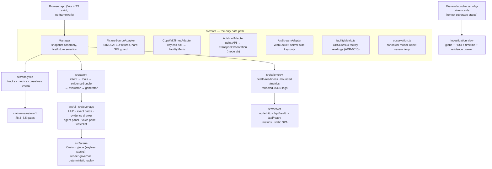

# chokepoint_app — Provenance-aware transportation intelligence

**Live deployment: https://pcschmidt.github.io/chokepoint_app/** (static
fixture-mode SPA, CI-deployed on every push to main) **plus** a local Docker
Compose observability stack (`app` + Prometheus + Grafana). This is the
data-layer + evaluation pillar of a personal AI-engineering portfolio.

## What is this? (plain-language overview)

Chokepoint answers a real operational question — *how busy is this maritime
chokepoint, compared to normal, and what evidence supports that?* — over
public transportation signals, with provenance attached to every number. Its
central capability is a verified analytical workflow:

> Observe movement → derive operational metrics → compare with a baseline →
> detect meaningful change → explain the result with evidence and uncertainty.

The thing that makes it more than a map with pins:

- **Deterministic analytics before any AI.** Six component metrics (vessel
  count, moving fraction, dwell estimates, entry/exit) are computed by
  documented, versioned formulas over normalized observations, with reviewed
  geofences owned by a named human reviewer.
- **A verified agent, evaluator-gated.** A typed-intent parser maps plain
  questions onto an allowlisted tool set; tools read only manager snapshots;
  a claim evaluator (claim-evaluator-v1) rejects causal/threat/prediction
  language, requires provenance on every claim, and checks every number
  against the metrics — 25/25 on a labeled groundedness suite. The answer
  generator renders ONLY evaluator-accepted claims, structurally.
- **Truth states as a product feature.** Every value on screen carries
  OBSERVED / DERIVED / SIMULATED / UNKNOWN vocabulary (§3.1). Zero
  observations is displayed as "coverage unknown, not zero" — absence of
  evidence is never treated as evidence of absence.
- **Multimodal by extension, honestly.** Air (adsb.lol) and land (CBP border
  wait times) layers went through the same admission gate, ADR process, and
  fixture-first build as the maritime core — including rejecting OpenSky on
  its own terms and deferring rail when no live source exists.

You can drive it three ways:

1. **The published SPA** — mission launcher → investigation: keyless Cesium
   globe, six-metric freight HUD, deterministic replay, event cards, evidence
   drawer, watchlist, and the text/voice agent, all on SIMULATED fixtures.
2. **The evaluation suites** — `npm run eval` (detector precision/recall/F1
   over labeled scenarios), `npm run eval:agent` (groundedness: numeric
   accuracy, provenance coverage, banned-language and fabricated-number
   rejection, abstention quality), `npm run perf:replay` (frame-budget
   profiling), `npm run qa:browser` (pixel-verified rendering).
3. **The observability stack** — `docker compose up` serves the app with local
   Prometheus and Grafana (§13.2 dashboards), plus `/api/health`, `/api/ready`,
   and a bounded-label `/metrics` endpoint; keyless live CBP/adsb adapters are
   wired and tested at the manager level.

| | |
| --- | --- |
| Live demo | https://pcschmidt.github.io/chokepoint_app/ (static fixture-mode SPA; GitHub Pages via Actions) |
| Local stack | Docker Compose: app (static + `/api/*` + `/metrics`) + Prometheus + Grafana, fixture mode, zero credentials |
| Data | Checked-in SIMULATED fixtures for everything demo-visible; keyless live adapters (CBP wait times VERIFIED live, adsb.lol ODbL) wired at the manager level |
| Geofences | 9 reviewed v1 fences (6 maritime + 3 multimodal), named review owner, per-vertex provenance |
| Verified agent | typed intents → allowlisted tools → evidence bundles → claim-evaluator-v1 → accepted-claims-only answers; groundedness 25/25 |
| Multimodal | air (adsb.lol, operator cohorts inferred — never asserted) + land (CBP wait times, OBSERVED facility metrics per ADR-0015); rail deferred on evidence (ADR-0014) |
| Tests | 326 passing, offline and deterministic (`npm test`) |
| Honest scope | portfolio project; all on-screen data SIMULATED; no auth, no TLS, no multi-user serving; browser app never calls live providers |

## Architecture at a glance



Where things live:

| Path | What it is |
| --- | --- |
| `src/data/observation.ts` | Canonical observation model: validation rejects (never clamps), deterministic dedupe/order, stable entity identity |
| `src/data/facilityMetric.ts` | Facility-level OBSERVED readings (ADR-0015) — border wait times, closed vocabularies |
| `src/data/geofences.ts` | Reviewed-fence registry, ray-cast membership, placeholder gate (ADR-0007) |
| `src/config/chokepoints.ts` | Five profiles (3 maritime + 2 multimodal), 9 reviewed fences, data-driven (§4.3) |
| `src/data/aisStreamAdapter.ts` | Live AIS (admitted, risk-accepted ADR-0010); server-side key |
| `src/data/cbpWaitTimesAdapter.ts` | Live CBP border wait times (ADR-0013, keyless) → FacilityMetric |
| `src/data/adsbLolAdapter.ts` | Live aircraft via adsb.lol (ADR-0012, ODbL); operator cohorts inferred, never asserted |
| `src/data/fixtureAdapter.ts` + `fixtureLoader.ts` | SIMULATED fixtures with a hard provenance guard (§12.2) |
| `src/analytics/` | Track segmentation, the six §7 metrics, baseline comparison (§8.4), threshold event detector |
| `src/agent/` | intent → tools → evidenceBundle → evaluator → generator; voiceSession (keyless Web Speech) |
| `src/ui/`, `src/overlays/` | Launcher, freight HUD, timeline, evidence drawer, agent panel, watchlist, event cards |
| `src/scene/` | Cesium globe, keyless map stacks, render governor (bounded cohorts), deterministic replay controller |
| `src/telemetry/`, `src/server/` | Health/readiness (§10.3), bounded Prometheus registry (§13.1), redacted JSON logs (§13.3), static+API server |
| `tests/` | 326 offline tests incl. labeled evaluation suites (detector + groundedness) |
| `research/` | Provider terms research (AIS + multimodal), geofence candidates with per-vertex provenance |
| `evaluation-reports/` | Committed detector + groundedness reports (§12.6, regenerate via npm scripts) |
| `docs/decisions/` | 15 ADRs — every non-trivial decision recorded |
| `docs/security-review-2026-09-10.md` | Security review: 10 PASS checks + accepted residuals (§14) |
| `docs/case-study.md` | The product story with measured results |
| `docs/phase6-beta-decision.md` | Phase 6 public-beta decision memo |
| `NON_CLAIMS.md` | What the product does not claim (user-facing, §14.4) |
| `observability/` | Prometheus scrape config + Grafana dashboards provisioning |
| `CHOKEPOINT-PLAN.md` | The plan (source of truth); `STATUS.md` records what is actually built |

## Quickstart

```bash
git clone https://github.com/PCSchmidt/chokepoint_app
cd chokepoint_app
npm install
npm test            # 326 offline, deterministic tests (no network, no keys)

npm run dev         # vite dev server, fixture-mode UI
# or the production build + local stack:
npm run build
npm run serve       # serves dist/ + /api/health + /api/ready + /metrics on :8787
docker compose up -d --build   # app + prometheus + grafana (fixture mode, no credentials)
#   app:        http://localhost:8787
#   prometheus: http://localhost:9090   (target app:8787 -> up)
#   grafana:    http://localhost:3000   (pre-provisioned dashboards)
```

Evaluation and QA commands (all offline except the browser suites, which run
against localhost):

```bash
npm run eval          # detector evaluation report (§12.6)
npm run eval:agent    # agent groundedness report — 25/25 (§12.4)
npm run perf:replay   # replay frame-budget profiling (§12.5)
npm run qa:browser    # Playwright: both chokepoints render, pixels verified
```

## Approach: why it is built this way

- **Deterministic metrics before generative AI.** Every number is a
  reproducible, versioned formula over normalized observations; the LLM-free
  evaluator can recompute what it checks. The agent draft layer is
  deterministic templates today, with the contract designed so an LLM could
  replace the wording without touching the trust boundary.
- **The evaluator cannot be bypassed.** `draftAnswer` accepts a verdict
  object, not raw claims — accepted-claims-only rendering is structural, and
  banned-language/provenance/numeric checks run before anything is shown.
- **Sources are admitted, not assumed.** Every provider went through the §6.1
  gate with primary-source terms research and an ADR: AISStream admitted as a
  documented risk acceptance (no ToS exists — ADR-0010); OpenSky REJECTED for
  live use on its own written terms (ADR-0012); adsb.lol admitted under ODbL
  with share-alike honored in code (bounded buffers, no redistribution); CBP
  admitted keyless (ADR-0013); rail deferred because no live source exists
  (ADR-0014).
- **Unknown is a first-class answer.** Zero observations renders "coverage
  unknown, not zero"; Suez shows an explicit coverage-UNKNOWN state; the agent
  abstains with a reason instead of guessing scope; facility readings missing
  are omitted, never zero-filled.
- **Geometry is a human gate.** Every fence starts as placeholder geometry
  that throws on use; only a named human review owner can approve v1 with
  per-vertex provenance (ADR-0007/0011) — the multimodal fences went through
  the identical gate.
- **Replay is deterministic and measured.** The cursor advances by fixed
  ticks, never the wall clock; the perf profiler measures real Cesium render
  cost via pre/post-render deltas and caught a real bug (the replay cursor
  never visibly advanced) that synthetic tests had missed.
- **Keyless-first, honest degradation.** The demo runs with zero credentials;
  every live source degrades to UNAVAILABLE + fixture fallback, never to a
  broken app; no key ever reaches a log line or the UI.
- **Boring, well-supported tooling.** Vite + strict TypeScript, CesiumJS,
  Vitest, Playwright, dependency-free node:http server and Prometheus
  registry — chosen so a reviewer can read and run everything.

## Motivation

The goal is to demonstrate the full AI-engineering lifecycle on a
transportation-intelligence problem, with the trust boundary as the
differentiator: how data is admitted (terms research per provider), how it is
normalized and quality-labeled, how metrics stay deterministic, and how a
generative layer answers questions without ever exceeding its evidence.

**This is a portfolio project. All on-screen data is SIMULATED; nothing here
is a live logistics claim, and the product explicitly does not assert intent,
cause, or completeness** (see `NON_CLAIMS.md`).

## Method (what the pipeline actually does)

- **Normalization (§5.2).** Provider payloads → canonical
  `TransportObservation`: invalid coordinates rejected (never clamped),
  deterministic dedupe and total ordering, stable provider-scoped entity
  identity, AIS sentinels handled per ITU-R M.1371 (SOG 102.3 kn, heading 511°
  mean "not available" and are omitted).
- **Classification (§3.3).** ITU ship-type codes 70–89 → cargo/tanker;
  everything else is visible context but excluded from freight totals; air
  cargo cohorts are inferred from callsign prefixes over provider-published
  metadata and labeled `classification: "inferred"` — never asserted as
  broadcast fact (§8.4 IDENTITY).
- **Reviewed geofences (§5.4).** Nine approved fences with per-vertex
  provenance (CFR/SCA/OSM-tagged), placeholder gate intact for any future
  region. Membership is even-odd ray-casting, re-validated at point of use.
- **Metrics (§7).** vessel_count (unique classified entities in-fence),
  moving_fraction (missing speed excluded, never "stopped"), dwell estimates
  (conservative longest-visit split, gap-bounded), entry/exit (gap-excluded,
  uncertain reported). Every metric is a `DerivedMetric` with formulaVersion,
  inputs, and quality block.
- **Baselines + detector (§8.4).** Like-metric comparisons against a named
  prior window (type + unit enforced; null/low-sample → UNKNOWN, never a
  confident estimate) feeding threshold-crossing event rules that carry no
  causal text.
- **Verified agent (§8).** Deterministic intent parser (closed vocabulary,
  abstains rather than guessing scope) → allowlisted tools over manager
  snapshots → content-addressed evidence bundles (§5.6) → claim evaluator
  (banned language, provenance-required, scope semantics, every number matched
  to a metric) → generator rendering accepted claims only. Facility wait-time
  answers and aircraft answers go through the identical gates.
- **Multimodal extension (ADR-0012/0013/0015).** Land: CBP border wait times
  as OBSERVED `FacilityMetric` records (a separate model — facility data
  never mixes into entity totals). Air: adsb.lol aircraft as
  `TransportObservation` with inferred operator cohorts. Both wired into the
  manager with keyless live layers and honest fixture fallbacks; the browser
  app itself stays fixture-mode by design.

## Results

All numbers are committed artifacts, regenerable from the repo
(`evaluation-reports/`, `research/perf/`):

- **Deterministic suite**: 326 tests across normalization, geofence machinery,
  health states, metrics, detectors, adapters, agent, UI render, PWA, server
  integration — all offline, CI-green without credentials or network.
- **Detector evaluation** (labeled scenarios): precision 1.0, recall 0.75,
  F1 0.857, 0 false positives, with documented known failures
  (`evaluation-reports/evaluation-report-2026-09-09.md`).
- **Agent groundedness** (25 labeled scenarios, `evaluation-reports/agent-2026-09-10.md`):
  fabricated numbers rejected, unsupported/causal/threat/predictive claims
  rejected, scope overreach ("all vessels at the port") rejected, provenance
  required, abstention quality verified (out-of-domain and threat questions
  abstain; Suez answers "unknown, not zero" — never a fabricated count).
- **Replay performance** (§12.5 budgets): render mean 3.0 ms / p95 4.7 ms /
  max 5.5 ms (budgets 33/250 ms); scrub mean ~128 ms (budget 250 ms); zero
  idle renders; 0.0% heap growth over globe mount/unmount cycles.
- **Browser QA**: 29/29 maritime vessel points verified rendered by canvas
  pixel sampling, zero console/page errors.
- **Live coverage evidence**: a 5-minute live AISStream window accepted 571
  records / 123 classified entities — LA/LB and Singapore covered, Suez
  recorded as coverage-UNKNOWN (never zero).
- **Live CBP verification**: `bwt.cbp.gov/api/waittimes` answered keyless with
  all 85 US crossings (sample archived; El Paso BOTA/PDN/Ysleta included).
- **Operations**: `docker compose up` verified — Prometheus target `up = 1`,
  Grafana dashboards provisioned, readiness/liveness honest.

## Limitations

- **All on-screen data is SIMULATED.** The demo surfaces checked-in synthetic
  fixtures; live adapters exist and are tested at the manager level but the
  browser app never calls them — the browser-live path (§10.2 hosted API) is
  deliberately unbuilt. No live-data results are claimed anywhere.
- **The live smoke was local-only and one window long** (5 minutes of
  AISStream); Suez coverage-UNKNOWN comes from that window, not a study.
- **Operator classification is inference, not broadcast truth.** Aircraft
  carry no cargo flag; freight cohorts come from callsign-prefix heuristics
  over provider-published metadata and are labeled inferred. The agent may
  never claim "a FedEx flight" unless the provider published the operator.
- **adsb.lol is ODbL 1.0** (share-alike honored by bounded buffers and no
  redistribution; any published derived database must itself be ODbL).
  **OpenSky was rejected for live use** — its terms require a written
  agreement for operational REST use, even non-profit (verified from its own
  terms page, ADR-0012).
- **CBP update cadence is per-port and periodic**; hours-stale readings at
  quiet crossings are normal, and the freshness threshold reflects that.
  US-side data only.
- **Geofences are coarse demo fences, not official boundaries** — the El Paso
  frames are display framing only; the LAX box is a regional query region, not
  an FAA sector.
- **No auth, no TLS, no multi-user serving, no rate limiting**; the local
  Docker stack binds host ports for the demo. A public deployment would need
  the §16.2 review first (the security review records this as an accepted
  residual).
- **Rail is deferred on evidence** (ADR-0014): only a static crossing
  inventory exists publicly; it must never be presented as a movement signal.
- The static hosting (GitHub Pages) serves the SPA only — `/api/*` and
  Grafana are the local Docker story; the browser app has no calls to them.

## Operational notes

Requirements: Node 20+ and npm (dev), Docker Desktop (observability stack).

```
npm install && npm test      # 326 offline tests
npm run build && npm run serve   # production build + local API/metrics on :8787
docker compose up -d --build # app + prometheus + grafana (fixture mode, no credentials)
docker compose down
```

- **Health/readiness** (§16.1): `GET /api/health` (liveness), `GET /api/ready`
  (profiles registered, default window resolvable, per-source honest states —
  a missing live key is UNAVAILABLE, never a readiness failure).
- **Metrics** (§13.1): `/metrics` renders the Prometheus text format with
  bounded labels only (route enums, status classes, §8.4 rejection
  categories). HTTP counters at the server boundary; evidence-bundle /
  claim-accepted / claim-rejected / agent-request counters in the pipeline.
- **Logs** (§13.3): one JSON line per request (correlation id, request id,
  status, duration, route, error class) with structural redaction of
  key/token/authorization patterns; there is no field for secrets.
- **CI** runs lint + 326 tests + build on every push; the Pages workflow
  deploys the SPA on main. Docker images are built locally; nothing is pushed
  to any registry.
- **Evaluation artifacts** (§12.6): `evaluation-reports/` (detector +
  groundedness), `research/perf/` (replay budgets) — all regenerable via the
  npm scripts above.

### Deploy target decision

Two targets, both deliberate: **GitHub Pages** hosts the static fixture-mode
SPA (free, CI-deployed, matches the Phase 6 beta recommendation of publishing
the demo for observation), and **local Docker Compose** hosts the operations
story (app + Prometheus + Grafana). No paid hosting, no public API, no
multi-user serving is claimed or wanted at this stage; the security review
records what a public API deployment would add (rate limiting, non-root
container, hosted key proxy) as accepted residuals for the local demo.

### Source admission record (§6.1)

Every live source carries a terms decision made on primary-source research,
never assumed:

| Source | Decision | ADR | Key facts |
| --- | --- | --- | --- |
| AISStream.io (sea) | admitted, risk-accepted | ADR-0010 | free; **no data-use ToS exists** (verified absence); server-side key; in-memory bounded buffer |
| adsb.lol (air) | admitted, risk-accepted | ADR-0012 | free; **ODbL 1.0** for API + all public data (share-alike honored in code); no key today |
| OpenSky (air) | **rejected for live use** | ADR-0012 | terms require a written agreement for ANY operational REST integration, even non-profit (verified) |
| CBP bwt.cbp.gov (land) | admitted | ADR-0013 | keyless; verified live with 85 crossings; US-gov public-domain basis |
| FRA rail (rail) | **deferred** | ADR-0014 | only a static crossing inventory exists publicly; no live blockage feed |

### Verify the claims (a reviewer's path)

```bash
npm test                # 326 tests — includes every claim below that is testable offline
npm run eval:agent      # regenerate the groundedness report (25/25)
npm run eval            # regenerate the detector report (precision 1.0 / recall 0.75)
npm run perf:replay     # regenerate the §12.5 budget profile (PASS)
npm run qa:browser      # pixel-verified rendering of both maritime chokepoints
docker compose up -d --build
curl -s http://localhost:8787/api/ready   # honest readiness with per-source states
curl -s http://localhost:8787/metrics     # bounded-label exposition
docker compose down
```

The live SPA (fixture data, PWA offline shell) is at
https://pcschmidt.github.io/chokepoint_app/ — every number it shows traces to
a committed SIMULATED fixture and a tested formula, and the SIM badge says so
on screen.
